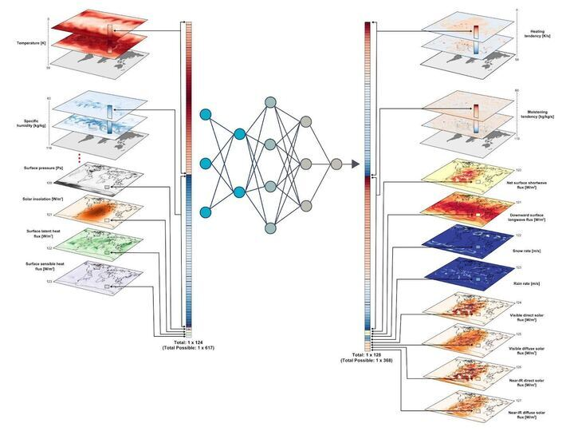
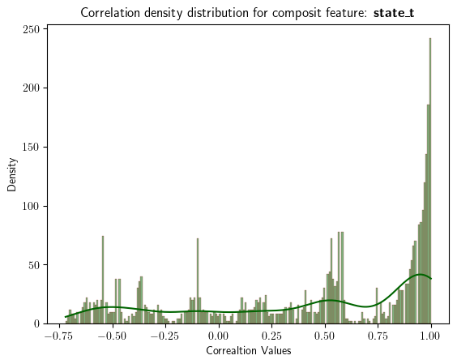

# LEAP - Atmospheric Physics using AI (ClimSim) - Capstone Project
**Author:** Samir Sebbah

## Introduction

Climate models are cost effective and efficient tools that scientists use to test their understanding of our climate system, and to predict future changes to our climate. Scientists use climate models to evaluate their understanding of the climate, and test out their hypotheses. 
…
… Because of the complexity of Earth’s climate, these models rely on parameterizations to approximate the effects of physical processes that occur at scales smaller than the size of their grid cells. These approximations are imperfect, however, and their imperfections are a leading source of uncertainty in expected warming, changing precipitation patterns, and the frequency and severity of extreme events. The Multi-scale Modeling Framework (MMF) approach, by contrast, more explicitly represents these subgrid processes, but at a cost too high to be used for operational climate prediction 
$\ldots$ [extracted from project page on Kaggle](https://www.kaggle.com/competitions/leap-atmospheric-physics-ai-climsim).


<div style="text-align: center;">

<p align="center"><b>Figure 1: Climate prediction</b></p>
</div>


## Input Data

### Dataset Description

The dataset for the project is generated by the (E3SM-MMF) climate model ([More details about the data collection processes](https://www.kaggle.com/competitions/leap-atmospheric-physics-ai-climsim/data)). The multi-scale nature of E3SM-MMF allows it to explicitly resolve the effects of small-scale processes such as clouds and storms on large-scale climate patterns. Every row of the training set corresponds to the inputs and outputs of a cloud-resolving model (CRM) in E3SM-MMF at some location and timestep.

There are 556 columns corresponding to 25 input variables and 368 columns corresponding to 14 target variables. Some variables (like air temperature) span an entire atmospheric column and have 60 vertical levels, and other variables (like precipitation) are scalars. For the vertically resolved variables, an "_" followed by a number in the range [0,59] is appended to denote vertical level.

In this project, although high resolution data is available to use on HuggingFace, I am making use of a subset of the low-resolution data from ClimSim using the full variable list. The low-resolution dataset for both testing and training is of size 377.27 GB.

### Data availability and format

The first step of this project is to pull the selected data from Kaggle to Google Drive and making it available for the EDA phase.
The zipped folder, which is of size 76G, contains both test and train data in separate files. 

The variables with multiple dimensions are referred to as <b>composite features.variables</b> in this capstone project. The scaler variables are grouped together under a composite feature named <b>scaler feature/variable</b>.

```bash
composite feature state_t has 60 features
composite feature state_q0001 has 60 features
composite feature state_q0002 has 60 features
composite feature state_q0003 has 60 features
composite feature state_u has 60 features
composite feature state_v has 60 features
composite feature pbuf_ozone has 60 features
composite feature pbuf_CH4 has 60 features
composite feature pbuf_N2O has 60 features
composite feature scaler has 16 features
```

#### Examples of composite features:

```bash

state_t: 
Index(['state_t_0', 'state_t_1', 'state_t_2', 'state_t_3', 'state_t_4',
       'state_t_5', 'state_t_6', 'state_t_7', 'state_t_8', 'state_t_9',
       'state_t_10', 'state_t_11', 'state_t_12', 'state_t_13', 'state_t_14',
       'state_t_15', 'state_t_16', 'state_t_17', 'state_t_18', 'state_t_19',
       'state_t_20', 'state_t_21', 'state_t_22', 'state_t_23', 'state_t_24',
       'state_t_25', 'state_t_26', 'state_t_27', 'state_t_28', 'state_t_29',
       'state_t_30', 'state_t_31', 'state_t_32', 'state_t_33', 'state_t_34',
       'state_t_35', 'state_t_36', 'state_t_37', 'state_t_38', 'state_t_39',
       'state_t_40', 'state_t_41', 'state_t_42', 'state_t_43', 'state_t_44',
       'state_t_45', 'state_t_46', 'state_t_47', 'state_t_48', 'state_t_49',
       'state_t_50', 'state_t_51', 'state_t_52', 'state_t_53', 'state_t_54',
       'state_t_55', 'state_t_56', 'state_t_57', 'state_t_58', 'state_t_59'],
      dtype='object')
```

```bash
scaler:
Index(['state_ps', 'pbuf_SOLIN', 'pbuf_LHFLX', 'pbuf_SHFLX', 'pbuf_TAUX',
       'pbuf_TAUY', 'pbuf_COSZRS', 'cam_in_ALDIF', 'cam_in_ALDIR',
       'cam_in_ASDIF', 'cam_in_ASDIR', 'cam_in_LWUP', 'cam_in_ICEFRAC',
       'cam_in_LANDFRAC', 'cam_in_OCNFRAC', 'cam_in_SNOWHLAND'],
      dtype='object')
```

The grouping of features is defined to handle, in an efficient and scalable way, the large size input data. Furthermore, given that the multiple dimensions of each composite feature are measurements of the features at different levels (horizontal scale), then it makes sense to inspect/analyze those features together for independence and correlation 


All the input/output variables are all numerical variables. The target variables form a vector of 360 numerical values

```bash
<class 'pandas.core.frame.DataFrame'>
RangeIndex: 1000000 entries, 0 to 999999
Columns: 360 entries, ptend_t_0 to ptend_v_59
dtypes: float64(360)
memory usage: 2.7 GB
```

Given the available high quality input data, we did not have to perform data preprocessing to clean and/or impute the data. We focused our efforts on the data engineering to scale up the machine learning models

### Grouping of composite features 
The motivation behind the grouping of features into composite features is motivated by the need for scalable methods to handle the large amount of data and scalability of the ML modeling. 

A composite feature is a logical grouping of the features that measure the same metric at different levels (e.g., 60 vertical levels). The grouping is also meant to take advantage of the knowledge about the inter-dependecies among the features of the composite features.
The scaler features left out of the grouping of the composite features groupings are group together for convenience. 

The grouping above is used in the next EDA steps of EDA and modeling.

## EDA

Given the size of the input data, we decided to draw samples, instead of loading the whole data, for the EDA.

In the following, we explore data to gain insights about distributions and correlations.
Our main objective in this step is to come up with a subset of features/data points to feed a model for improved scalability and efficiency.

The below analysis is to performance some statistical analysis to study the data distributions and correlations. Each composite feature is separately loaded, analyzed, and exported for the ML model to use.


### Feature distribution analysis


In this section, 
we develop plots to visualize the distributions of the input featurs using Histograms. Our objective to gain better understanding of the underlying patterns, detecting outliers, and identifying potential issues. This step is also used in subsequent steps to guide feature engineering, model selection, and preprocessing steps.

Per composite feature, the plots show the distribtions of the features. 
To keep this document concise, we did not report all the composite features. The next set of boxplots provides a better visuals of the aggregated statistics about the distributions of the features. 

<div style="text-align: center;">

<p align="center"><b>Figure 2: Feature distribution (composite feature: state_t) - histogram</b></p>
</div>

<div style="text-align: center;">


<p align="center"><b>Figure 3: Feature distribution (composite feature: all) - boxplot</b></p>
</div>


#### Observations
Looking thru the sampled data we notice

1. Domains of the different distributions span different ranges even within the same composite features
2. Within the same composite features, some features seem to have the same data distribution - indicator of correlations
3. Within each of the composite feature, almost all the distributions are left/right skewed. 
4. Some features seem to have domains with very low values (close to zero) compare to others

### Feature correaltion analysis
The purpose of this analysis step is to understand the relationships between the features within our composite features in the dataset. Highly correlated features may provide redundant information, and weakly correlated features might suggest a lack of relationship. This analysis is important in feature selection and can also help identify multicollinearity in your data.

The plots below report the distributions of the correlations
coefficients between the features of each composite feature.

<div style="text-align: center;">



<p align="center"><b>Figure 4: Correlation distribution (composite feature: all)</b></p>
</div>

#### Observations

Looking thru the sampled data we notice

1. Within each composite feature, the correlation plots show strong correlations among the features of some composite features
2. Within each composite feature, most of the strong correlations (>0.98) are positive
3. Some features within composite features show strong negative correlations e.g., state_t, pbuf_ozone, scaler
3. Some features within composite features show almost no correlations e.g., state_q002

### Feature engineering

Based on the observation above, we decided to

1. Scale the data to transform the features to a consistent range.
2. Run a PCA model to reduce the data input size and select the relevant features to reduce/eliminate correlations

#### Scaling and PCA

Based on the previously formulated observations, In this step, we decided to use a standard scaling method to transform the data then a PCA method to reduce the number of input features. 

Scaling the input features and the output data is crucial for many machine learning algorithms, especially those that rely on distance measurements, gradients, or assumptions of data distributions. PCA is a statistical technique used in machine learning and data analysis to reduce the dimensionality of a dataset while retaining as much variance as possible. 


```bash
  # Standardize the data
  scaler = StandardScaler()
  scaler.fit(df)

  # Serialize the scaling model
  joblib.dump(scaler, output_file_name)
```

```bash
  # Create a PCA object, retaining the requested variance
  pca_model = PCA(n_components=0.98)

  # Fit PCA on the data
  pca_model.fit(nd_array)

  # Transform data into principal components
  pca_data = pca_model.transform(nd_array)

  # Serialize the model
  joblib.dump(pca_model, output_file_name)
```

The outputs of these two methods - scaling and pca models - are serialized for use in the subsequent steps of training, optimization, and prediction.

```bash
composite feature:  state_t
The number of original features: 60
The number of principal components selected: 9
composite feature:  state_q0001
The number of original features: 60
The number of principal components selected: 13
composite feature:  state_q0002
The number of original features: 60
The number of principal components selected: 30
composite feature:  state_q0003
The number of original features: 60
The number of principal components selected: 22
composite feature:  state_u
The number of original features: 60
The number of principal components selected: 8
composite feature:  state_v
The number of original features: 60
The number of principal components selected: 14
composite feature:  pbuf_ozone
The number of original features: 60
The number of principal components selected: 6
composite feature:  pbuf_CH4
The number of original features: 60
The number of principal components selected: 3
composite feature:  pbuf_N2O
The number of original features: 60
The number of principal components selected: 3
composite feature:  scaler
The number of original features: 16
The number of principal components selected: 10
```

### Observations
1. The pca model picked more components to achieve 98% variability within composite features with low correlations, e.g., state_q0002
2. The pca model picked a very low percent of features to achieve 98% variability within composite features with high correlations, e.g., pbuf_CH4, pbuf_N20
3. Overall, the PCA model achieved high dimensionality reduction across all compoist features.


### More opportunities

1. Adopt a scaling cusomized for each of the composite features. The data distributions are different, some distrbutions are nearing zero and bearily visible on the plots.
2. Outliers are present in every measure, finding a strategy to handle those in order to bring more stability to the learning process in the ML model

## Data processing architecture

We used Google drive and Colab as the development enviorment in the data processing steps. Google drive offer storage and APIs to pulled Kaggle data and store large amount of data and access it during development.  

The diagram below highlights the different components of the data processing step.
1. raw data is pulled from Kaggle into Google drive
2. After sampling, scaling and PCA models are build for each composite features.
3. The scaling and pca models are saved after training
4. The PCs of the scaled data are saved for busequent modeling steps

<div style="text-align: center;">

<p align="center"><b>Figure 5: Data processing architecture </b></p>
</div>

### Outputs

Edited command line output to trim some redundant fields

#### PCA models

```bash
/content/drive/MyDrive/leap_sim_project# ls -alX *pca_model2*
2991 Oct 18 11:14 composit_feature_pbuf_CH4_pca_model2.pkl
2991 Oct 18 11:14 composit_feature_pbuf_N2O_pca_model2.pkl
4503 Oct 18 11:14 composit_feature_pbuf_ozone_pca_model2.pkl
2647 Oct 18 11:14 composit_feature_scaler_pca_model2.pkl
8031 Oct 18 11:13 composit_feature_state_q0001_pca_model2.pkl
16599 Oct 18 11:13 composit_feature_state_q0002_pca_model2.pkl
12567 Oct 18 11:14 composit_feature_state_q0003_pca_model2.pkl
6015 Oct 18 11:13 composit_feature_state_t_pca_model2.pkl
5511 Oct 18 11:14 composit_feature_state_u_pca_model2.pkl
8535 Oct 18 11:14 composit_feature_state_v_pca_model2.pkl
```

#### Scaling model

```bash
/content/drive/MyDrive/leap_sim_project# ls -alX *scaling*
3415 Oct 18 11:14 composit_feature_pbuf_CH4_scaling_model2.pkl
3415 Oct 18 11:14 composit_feature_pbuf_N2O_scaling_model2.pkl
3543 Oct 18 11:14 composit_feature_pbuf_ozone_scaling_model2.pkl
1591 Oct 18 11:14 composit_feature_scaler_scaling_model2.pkl
3607 Oct 18 11:13 composit_feature_state_q0001_scaling_model2.pkl
3607 Oct 18 11:13 composit_feature_state_q0002_scaling_model2.pkl
3607 Oct 18 11:13 composit_feature_state_q0003_scaling_model2.pkl
3367 Oct 18 11:13 composit_feature_state_t_scaling_model2.pkl
3367 Oct 18 11:14 composit_feature_state_u_scaling_model2.pkl
3367 Oct 18 11:14 composit_feature_state_v_scaling_model2.pkl
16695 Oct 18 11:14 output_scaling2.pkl
```

### Principal components and transformed data


```bash
/content/drive/MyDrive/leap_sim_project# ls -alX *df2.parquet*
9184719 Oct 18 11:14 composit_feature_pbuf_CH4_df2.parquet
9211672 Oct 18 11:14 composit_feature_pbuf_N2O_df2.parquet
49683263 Oct 18 11:14 composit_feature_pbuf_ozone_df2.parquet
82804772 Oct 18 11:15 composit_feature_scaler_df2.parquet
107645918 Oct 18 11:13 composit_feature_state_q0001_df2.parquet
248412503 Oct 18 11:14 composit_feature_state_q0002_df2.parquet
182169396 Oct 18 11:14 composit_feature_state_q0003_df2.parquet
74524401 Oct 18 11:13 composit_feature_state_t_df2.parquet
66244018 Oct 18 11:14 composit_feature_state_u_df2.parquet
115926295 Oct 18 11:14 composit_feature_state_v_df2.parquet
2279539369 Oct 18 11:16 output_df2.parquet
```


#### Support material
1. The EDA.ipynb notebook

<hr>

## Modeling 

### Baseline models

ClimSim presents a regression problem with mapping from a multivariate input vector to a multivariate target output vector y ∈ 𝑅𝑑

In the ClimSim reference paper [[1]](#1), six baseline models used in the experiments are presented at a high level.

1. Multi-layer Perceptron (MLP)
2. Convolutional Neural Network (CNN)
3. Encoder-Decoder (ED)
4. Heteroskedastic Regression (HSR)
5. Randomized Prior Network (RPN)
6. Conditional Variational Autoencoder (cVAE)

The top solutions for this problem on Kaggle are also based on MLP.[[2]](#2)

### Our Approach

For our capstone project, we decided to use a multi-level perceptron (MLP) approach. We made the choice based on the simplicity of the architecture and implementation. Below we detail the implementation.

### Architecture

Our architecture is composed of:
1. Input Layer: Describes the input layer that takes in the concatenated composite features.
2. Batch Normalization Layer: Adds a batch normalization layer.
3. Hidden Layers: Details the hidden layers, including the number of neurons and activation functions.
4. Output Layer: Describes the output layer and its configuration.
5. Optimization: Details the hyperparameter optimization process used to tune the model.

The summary table provides a summary of the model's layers and their configurations.

Some of the inner details of the layers are provided by an optimization model used to optimize the hyperparameters of the architecture (more details are provided in the optimization section).

The next table and architecture diagram show more details about the architecture.

```bash
┏━━━━━━━━━━━━━━━━━━━━━━━━━━━┳━━━━━━━━━━━━━━━━━━━━━━━━┳━━━━━━━━━━━━━━━━┳━━━━━━━━━━━━━━━━━━━━━━━━┓
┃ Layer (type)              ┃ Output Shape           ┃        Param # ┃ Connected to           ┃
┡━━━━━━━━━━━━━━━━━━━━━━━━━━━╇━━━━━━━━━━━━━━━━━━━━━━━━╇━━━━━━━━━━━━━━━━╇━━━━━━━━━━━━━━━━━━━━━━━━┩
│ state_t (InputLayer)      │ (None, 9)              │              0 │ -                      │
├───────────────────────────┼────────────────────────┼────────────────┼────────────────────────┤
│ state_q0001 (InputLayer)  │ (None, 13)             │              0 │ -                      │
├───────────────────────────┼────────────────────────┼────────────────┼────────────────────────┤
│ state_q0002 (InputLayer)  │ (None, 30)             │              0 │ -                      │
├───────────────────────────┼────────────────────────┼────────────────┼────────────────────────┤
│ state_q0003 (InputLayer)  │ (None, 22)             │              0 │ -                      │
├───────────────────────────┼────────────────────────┼────────────────┼────────────────────────┤
│ state_u (InputLayer)      │ (None, 8)              │              0 │ -                      │
├───────────────────────────┼────────────────────────┼────────────────┼────────────────────────┤
│ state_v (InputLayer)      │ (None, 14)             │              0 │ -                      │
├───────────────────────────┼────────────────────────┼────────────────┼────────────────────────┤
│ pbuf_ozone (InputLayer)   │ (None, 6)              │              0 │ -                      │
├───────────────────────────┼────────────────────────┼────────────────┼────────────────────────┤
│ pbuf_CH4 (InputLayer)     │ (None, 3)              │              0 │ -                      │
├───────────────────────────┼────────────────────────┼────────────────┼────────────────────────┤
│ pbuf_N2O (InputLayer)     │ (None, 3)              │              0 │ -                      │
├───────────────────────────┼────────────────────────┼────────────────┼────────────────────────┤
│ scaler (InputLayer)       │ (None, 10)             │              0 │ -                      │
├───────────────────────────┼────────────────────────┼────────────────┼────────────────────────┤
│ concatenate_1             │ (None, 118)            │              0 │ state_t[0][0],         │
│ (Concatenate)             │                        │                │ state_q0001[0][0],     │
│                           │                        │                │ state_q0002[0][0],     │
│                           │                        │                │ state_q0003[0][0],     │
│                           │                        │                │ state_u[0][0],         │
│                           │                        │                │ state_v[0][0],         │
│                           │                        │                │ pbuf_ozone[0][0],      │
│                           │                        │                │ pbuf_CH4[0][0],        │
│                           │                        │                │ pbuf_N2O[0][0],        │
│                           │                        │                │ scaler[0][0]           │
├───────────────────────────┼────────────────────────┼────────────────┼────────────────────────┤
│ batch_normalization_1     │ (None, 118)            │            472 │ concatenate_1[0][0]    │
│ (BatchNormalization)      │                        │                │                        │
├───────────────────────────┼────────────────────────┼────────────────┼────────────────────────┤
│ dense_3 (Dense)           │ (None, 369)            │         43,911 │ batch_normalization_1… │
├───────────────────────────┼────────────────────────┼────────────────┼────────────────────────┤
│ dense_4 (Dense)           │ (None, 385)            │        142,450 │ dense_3[0][0]          │
├───────────────────────────┼────────────────────────┼────────────────┼────────────────────────┤
│ dense_5 (Dense)           │ (None, 368)            │        142,048 │ dense_4[0][0]          │
└───────────────────────────┴────────────────────────┴────────────────┴────────────────────────┘

 Total params: 328,881 (1.25 MB)

 Trainable params: 328,645 (1.25 MB)

 Non-trainable params: 236 (944.00 B)

```

<div style="text-align: center;">

<p align="center"><b>Figure 6: Model architecture</b></p>
</div>

### Implementation

The implementation of the MLP model is highlighted in the flowchart below.
It includes
1. Pulling the PCs from the input repository  
2. Implementing the architecture described above (with the layers, etc)
3. Getting the optimized values of the hyperparameters of the model from an optimization module (see Optimization section below)
4. Training the model
5. Saving the trained model to storage for predictions 

<div style="text-align: center;">

<p align="center"><b>Figure 7: Modeling</b></p>
</div>

### Training

We used Google Colab in the training of the model.
The following GPU hardware configuration was used to optimize the training time.

```bash     
+---------------------------------------------------------------------------------------+
| NVIDIA-SMI 535.104.05             Driver Version: 535.104.05   CUDA Version: 12.2     |
|-----------------------------------------+----------------------+----------------------+
| GPU  Name                 Persistence-M | Bus-Id        Disp.A | Volatile Uncorr. ECC |
| Fan  Temp   Perf          Pwr:Usage/Cap |         Memory-Usage | GPU-Util  Compute M. |
|                                         |                      |               MIG M. |
|=========================================+======================+======================|
|   0  NVIDIA L4                      Off | 00000000:00:03.0 Off |                    0 |
| N/A   76C    P0              37W /  72W |   2879MiB / 23034MiB |      0%      Default |
|                                         |                      |                  N/A |
+-----------------------------------------+----------------------+----------------------+
                                                                                         
+---------------------------------------------------------------------------------------+
| Processes:                                                                            |
|  GPU   GI   CI        PID   Type   Process name                            GPU Memory |
|        ID   ID                                                             Usage      |
|=======================================================================================|
+---------------------------------------------------------------------------------------+

```

### Optimization

An optimization step was added to optimize the following hyperparameters of the model

```bash
search_space = [
    Real(1e-4, 1e-2, "log-uniform", name="learning_rate"),
    Integer(50, 80, name="batch_size"),  
    Integer(30, 50, name="epochs"), 
    Integer(nbr_out_features, nbr_out_features+nbr_in_features)), name="num_neurons"),  
    Integer(1, 2, name="num_hidden_layers"), 
    Categorical(["relu", "tanh", "sigmoid"], name="activation")
]
```

The optimization model was run to generate the best values for the parameters. Below is a screenshot of the runtime logs and the best parameters after some iterations of the optimization model. 

```bash
Iteration No: 1 started. Evaluating function at random point.
Epoch 1/56
17392/17392 ━━━━━━━━━━━━━━━━━━━━ 65s 3ms/step - loss: 20.9641 - r_squared: 0.9689 - val_loss: 6.1217 - val_r_squared: 0.9910
Epoch 2/56
17392/17392 ━━━━━━━━━━━━━━━━━━━━ 41s 2ms/step - loss: 8.8735 - r_squared: 0.9870 - val_loss: 5.9489 - val_r_squared: 0.9913
Epoch 3/56
17392/17392 ━━━━━━━━━━━━━━━━━━━━ 40s 2ms/step - loss: 8.0636 - r_squared: 0.9882 - val_loss: 5.7701 - val_r_squared: 0.9915
Epoch 4/56
17392/17392 ━━━━━━━━━━━━━━━━━━━━ 40s 2ms/step - loss: 7.6579 - r_squared: 0.9887 - val_loss: 6.1128 - val_r_squared: 0.9910
Epoch 5/56
17392/17392 ━━━━━━━━━━━━━━━━━━━━ 40s 2ms/step - loss: 7.4757 - r_squared: 0.9890 - val_loss: 6.4441 - val_r_squared: 0.9906
Epoch 6/56
17392/17392 ━━━━━━━━━━━━━━━━━━━━ 40s 2ms/step - loss: 7.3407 - r_squared: 0.9892 - val_loss: 5.9315 - val_r_squared: 0.9913
Epoch 7/56
17392/17392 ━━━━━━━━━━━━━━━━━━━━ 41s 2ms/step - loss: 7.1881 - r_squared: 0.9894 - val_loss: 5.4151 - val_r_squared: 0.9921
Epoch 8/56
17392/17392 ━━━━━━━━━━━━━━━━━━━━ 41s 2ms/step - loss: 7.0984 - r_squared: 0.9896 - val_loss: 5.8284 - val_r_squared: 0.9915
Epoch 9/56
17392/17392 ━━━━━━━━━━━━━━━━━━━━ 41s 2ms/step - loss: 7.0267 - r_squared: 0.9897 - val_loss: 6.8333 - val_r_squared: 0.9900
Epoch 10/56
17392/17392 ━━━━━━━━━━━━━━━━━━━━ 41s 2ms/step - loss: 6.9558 - r_squared: 0.9898 - val_loss: 5.2017 - val_r_squared: 0.9924
Epoch 11/56
17392/17392 ━━━━━━━━━━━━━━━━━━━━ 41s 2ms/step - loss: 6.9533 - r_squared: 0.9898 - val_loss: 5.8244 - val_r_squared: 0.9915
Epoch 12/56
17392/17392 ━━━━━━━━━━━━━━━━━━━━ 41s 2ms/step - loss: 6.9107 - r_squared: 0.9899 - val_loss: 7.0838 - val_r_squared: 0.9896
Epoch 13/56
17392/17392 ━━━━━━━━━━━━━━━━━━━━ 41s 2ms/step - loss: 6.7977 - r_squared: 0.9900 - val_loss: 7.0671 - val_r_squared: 0.9896
Epoch 14/56
17392/17392 ━━━━━━━━━━━━━━━━━━━━ 41s 2ms/step - loss: 6.8187 - r_squared: 0.9900 - val_loss: 5.7908 - val_r_squared: 0.9915
Epoch 15/56
17392/17392 ━━━━━━━━━━━━━━━━━━━━ 41s 2ms/step - loss: 6.8004 - r_squared: 0.9900 - val_loss: 6.2243 - val_r_squared: 0.9909
Epoch 16/56
17392/17392 ━━━━━━━━━━━━━━━━━━━━ 41s 2ms/step - loss: 6.7458 - r_squared: 0.9901 - val_loss: 4.9794 - val_r_squared: 0.9927
Epoch 17/56
17392/17392 ━━━━━━━━━━━━━━━━━━━━ 42s 2ms/step - loss: 6.7058 - r_squared: 0.9902 - val_loss: 5.6848 - val_r_squared: 0.9917
Epoch 18/56
17392/17392 ━━━━━━━━━━━━━━━━━━━━ 41s 2ms/step - loss: 6.7432 - r_squared: 0.9901 - val_loss: 5.1287 - val_r_squared: 0.9925
Epoch 19/56
17392/17392 ━━━━━━━━━━━━━━━━━━━━ 41s 2ms/step - loss: 6.6737 - r_squared: 0.9902 - val_loss: 6.2012 - val_r_squared: 0.9909
Epoch 20/56
17392/17392 ━━━━━━━━━━━━━━━━━━━━ 42s 2ms/step - loss: 6.6978 - r_squared: 0.9902 - val_loss: 4.8351 - val_r_squared: 0.9929
Epoch 21/56
17392/17392 ━━━━━━━━━━━━━━━━━━━━ 41s 2ms/step - loss: 6.7089 - r_squared: 0.9902 - val_loss: 5.9169 - val_r_squared: 0.9913
Epoch 22/56
17392/17392 ━━━━━━━━━━━━━━━━━━━━ 41s 2ms/step - loss: 6.6385 - r_squared: 0.9903 - val_loss: 5.0680 - val_r_squared: 0.9926
Epoch 23/56
17392/17392 ━━━━━━━━━━━━━━━━━━━━ 41s 2ms/step - loss: 6.6749 - r_squared: 0.9902 - val_loss: 4.8395 - val_r_squared: 0.9929
Epoch 24/56
17392/17392 ━━━━━━━━━━━━━━━━━━━━ 41s 2ms/step - loss: 6.6635 - r_squared: 0.9902 - val_loss: 5.5353 - val_r_squared: 0.9919
Epoch 25/56
17392/17392 ━━━━━━━━━━━━━━━━━━━━ 42s 2ms/step - loss: 6.5931 - r_squared: 0.9903 - val_loss: 4.6967 - val_r_squared: 0.9931
Epoch 26/56
17392/17392 ━━━━━━━━━━━━━━━━━━━━ 41s 2ms/step - loss: 6.6038 - r_squared: 0.9903 - val_loss: 5.6551 - val_r_squared: 0.9917
Epoch 27/56
17392/17392 ━━━━━━━━━━━━━━━━━━━━ 41s 2ms/step - loss: 6.6181 - r_squared: 0.9903 - val_loss: 5.4225 - val_r_squared: 0.9921
Epoch 28/56
17392/17392 ━━━━━━━━━━━━━━━━━━━━ 41s 2ms/step - loss: 6.5940 - r_squared: 0.9903 - val_loss: 5.3009 - val_r_squared: 0.9922
Epoch 29/56
17392/17392 ━━━━━━━━━━━━━━━━━━━━ 42s 2ms/step - loss: 6.5407 - r_squared: 0.9904 - val_loss: 5.2085 - val_r_squared: 0.9924
Epoch 30/56
17392/17392 ━━━━━━━━━━━━━━━━━━━━ 41s 2ms/step - loss: 6.5180 - r_squared: 0.9904 - val_loss: 5.0965 - val_r_squared: 0.9925
Epoch 31/56
17392/17392 ━━━━━━━━━━━━━━━━━━━━ 42s 2ms/step - loss: 6.5114 - r_squared: 0.9904 - val_loss: 5.3407 - val_r_squared: 0.9922
Epoch 32/56
17392/17392 ━━━━━━━━━━━━━━━━━━━━ 42s 2ms/step - loss: 6.5520 - r_squared: 0.9904 - val_loss: 6.0587 - val_r_squared: 0.9911
Epoch 33/56
17392/17392 ━━━━━━━━━━━━━━━━━━━━ 42s 2ms/step - loss: 6.5300 - r_squared: 0.9904 - val_loss: 5.1129 - val_r_squared: 0.9925
Epoch 34/56
17392/17392 ━━━━━━━━━━━━━━━━━━━━ 42s 2ms/step - loss: 6.5663 - r_squared: 0.9904 - val_loss: 5.2083 - val_r_squared: 0.9924
Epoch 35/56
17392/17392 ━━━━━━━━━━━━━━━━━━━━ 42s 2ms/step - loss: 6.4947 - r_squared: 0.9905 - val_loss: 5.7723 - val_r_squared: 0.9915
6250/6250 ━━━━━━━━━━━━━━━━━━━━ 15s 2ms/step - loss: 4.7060 - r_squared: 0.9931
Iteration No: 1 ended. Evaluation done at random point.
Time taken: 1483.2274
Function value obtained: 4.6967
Current minimum: 4.6967
Iteration No: 2 started. Evaluating function at random point.

Iteration No: 20 ended. Search finished for the next optimal point.
Time taken: 417.3327
Function value obtained: 6.5772
Current minimum: 4.1741
Best hyperparameters: [0.0008468986729585612, 80, 50, 369, 2, 'relu']
```

The best values for the selected hyperparameters

```bash
Best hyperparameters: [0.0008468986729585612, 80, 50, 369, 2, 'relu']
```

### Performance 

We measure the model's loss function during training, and evaluated the overall performance of our model using the R-squared coefficient. 

During training, the data was split into training and validation sets.
The plots below highlight the variations of the loss and R2 metrics during the training phase.

<div style="text-align: center;">

<p align="center"><b>Figure 7: Loss </b></p>
</div>

<div style="text-align: center;">

<p align="center"><b>Figure 8: R2 </b></p>
</div>

1.  In the first few epochs, both training loss (loss) and validation loss (val_loss) decrease, indicating the model is learning quickly thanks to the optimized hyperparameters of the model.
2. Both training and validation R-squared (r_squared, val_r_squared) are consistently high (above 0.99), suggesting the model explains a large portion of the target variable's variance.
3. Overfitting Concern: The increase in validation loss in Epoch 18, 34 raises a concern about potential overfitting. Continued training with this trend would likely worsen the model's ability to generalize to new data.


## Deployment
For the deployment phase, we choose to deploy the application using APIs and Docker for a robust and scalable solution. By containerizing the application with Docker, we can ensure that application runs consistently across different environments, from development to production. 

The current deployment leverages FastAPI to create a RESTful API for making predictions using the pre-trained model. The Dockerfile specifies the necessary dependencies and sets up the environment to run the FastAPI application using Uvicorn.  

The diagram below details the architecture of our deployment. 

<div style="text-align: center;">

<p align="center"><b>Figure 9: Deployment & request/Response APIs </b></p>
</div>

### Components
The key components of the architecture are:
1. FastAPI framework: The core of our application is built using FastAPI, a modern, fast (high-performance), web framework for building APIs. FastAPI allows us to define our API endpoints and handle HTTP requests efficiently.
2. Pre-trained MLP models: The MLP model is trained and saved as a .keras file, which is then loaded into the FastAPI application for making predictions. 
3. PCA and scaling models: The PCA and Scaling models are saved using joblib and loaded into the application to transform the input data before making predictions.
4. Docker containerization: The entire application, including the FastAPI server, TensorFlow model, and PCA and scaling models, is containerized using Docker.
5. Uvicorn server: Uvicorn is an ASGI server used to serve the FastAPI application. It is lightweight and fast, making it suitable for serving high-performance APIs.
6. API endpoints: The application exposes a /predict/ endpoint that accepts input data (payload) in JSON format, processes the payload using the PCA and scaling models, and makes predictions using the MLP model. The predictions are returned as a JSON response.

### Deployment process
1. Build the Docker image: The Dockerfile is used to build a Docker image of the application. This image includes all the necessary dependencies and configurations to run the application.
```bash
docker build -t my-fastapi-app . 
```

2. Run the Docker container: The Docker image is run as a container, exposing the FastAPI application on a selected port: 8000. 
```bash
docker run -d -p 8000:8000 my-fastapi-app
```
3. API request/response: clients can send HTTP POST requests to the /predict/ endpoint with the input data in JSON format. The application processes the input data, makes predictions, and returns the results as a JSON response. A light client is provided within the app repo to access the server side of the app. The client was used in the testing of the app and comes with a 
request paylod. 

```bash
# run the provided client or use any client with the provided/constructed payload
client.py
```
### Support material
The /app with Dockerfile, requirement.txt, main.py, client.py

### Testing

The deployed app was tested with the provided payload in the repo. The predictions are returned below

```bash
./client.py
{"prediction": [[367.40582275390625, 897.7156982421875, -701.498046875, -85.62568664550781, 4144.2900390625, 321.95172119140625, 186.01861572265625, -117.26776885986328, -506.0081481933594, 111.74371337890625, -126.90495300292969, -69.49525451660156, -540.2927856445312, -761.37255859375, -520.9150390625, -326.3428649902344, -1940.27099609375, -316.657958984375, -1687.7039794921875, 2058.256103515625, -1430.95703125, -784.4896850585938, 37.14625930786133, 107.42877197265625, -1493.6934814453125, -415.0162048339844, 3796.303955078125, 61.05229187011719, 790.9882202148438, 18.970056533813477, 198.37684631347656, -132.30584716796875, 5082.38134765625, -797.6927490234375, 481.2609558105469, -740.2771606445312, -433.38665771484375, 406.44207763671875, 119.97013092041016, 1154.2364501953125, 394.4085388183594, 539.6453247070312, 326.5618591308594, -106.35346984863281, 15.952543258666992, -2044.884765625, 159.31088256835938, 203.53346252441406, 732.305419921875, -86.4984130859375, -1129.170654296875, -214.90713500976562, -127.29680633544922, 1881.779541015625, 2454.818359375, 98.71929931640625, 208.39422607421875, -38.27425765991211, -756.0610961914062, -40.26115036010742, 3432.557861328125, -125.19677734375, 1166.310302734375, 129.6954345703125, -1294.4954833984375, -785.4030151367188, -89.53990173339844, 246.34938049316406, -3450.080078125, 2743.15673828125, -230.2406463623047, -429.76397705078125, -705.3050537109375, -179.2689666748047, -1690.822021484375, 186.07591247558594, 104.27352905273438, 540.2284545898438, -338.95318603515625, -3870.645751953125, -359.6858825683594, 278.6422424316406, -2417.207275390625, 870.295654296875, 4943.98046875, -951.3161010742188, 98.14521789550781, 104.55977630615234, 403.7383117675781, -591.81396484375, -562.9876098632812, 1290.953369140625, -2390.90771484375, 139.26031494140625, -323.2183837890625, -13.12265682220459, -627.1778564453125, -4023.149658203125, 374.2457275390625, -81.66059112548828, -271.40179443359375, 7144.654296875, 206.80581665039062, -602.7350463867188, 825.9277954101562, -407.3166809082031, 258.4385070800781, 237.2254638671875, 2627.21630859375, -3451.4609375, -31.906126022338867, 430.6255798339844, 30.974199295043945, -59.04555892944336, 119.34374237060547, 278.14080810546875, -2365.160400390625, 266.494873046875, -143.52235412597656, -281.4343566894531, 234.33160400390625, -270.9806213378906, -256.6128234863281, -62.06785202026367, 227.74075317382812, 832.97021484375, 111.65646362304688, 6.165055274963379, 213.6310272216797, -5694.71533203125, -126.3606185913086, 1659.2581787109375, 491.8929443359375, 284.99896240234375, -353.11029052734375, 1262.60205078125, -414.1139221191406, -60.669803619384766, 573.8432006835938, 3266.3359375, -25.84400749206543, 157.43389892578125, -431.9384765625, 1344.0086669921875, 97.16944122314453, -245.42356872558594, -62.27854919433594, -1009.3211669921875, -31.501813888549805, 372.4057312011719, -176.32669067382812, -1932.571044921875, -185.40576171875, 67.3060073852539, 143.21041870117188, -373.1363220214844, 673.5006713867188, 264.65997314453125, -3111.90771484375, -948.8382568359375, -39.65182876586914, 5325.22314453125, -168.53517150878906, -1333.4547119140625, -317.5550842285156, -1443.6773681640625, 563.7218017578125, 60.689964294433594, -790.2223510742188, 139.40611267089844, -347.99029541015625, 731.3627319335938, -550.063232421875, 259.2501220703125, 69.67909240722656, -281.2288818359375, -3178.3349609375, -408.417236328125, -5188.328125, 1199.5780029296875, 5982.4296875, 4260.85302734375, 2094.715576171875, 323.49896240234375, 504.36602783203125, 523.6369018554688, 4.04139518737793, -250.3376922607422, 125.0212173461914, -253.73263549804688, -140.2860565185547, 3729.08935546875, 1121.3258056640625, -89.69786071777344, 2131.863037109375, -1083.476318359375, 1569.56005859375, -262.56298828125, -4074.2783203125, -152.6931915283203, -5444.7109375, -192.03106689453125, 16.777212142944336, 773.7227783203125, -241.5963592529297, 4.289484024047852, 495.5754699707031, -340.17724609375, -148.67037963867188, -149.96331787109375, 51.40780258178711, -206.28219604492188, 739.8296508789062, -13.429000854492188, -49.68160629272461, -209.9824981689453, 1645.190185546875, 4521.07421875, -459.4579162597656, 71.72567749023438, -126.77352905273438, 5966.59521484375, -104.87328338623047, 397.756591796875, 1009.8296508789062, -5785.19140625, 3603.5361328125, 58.881988525390625, 213.13880920410156, -3229.245361328125, -4111.587890625, 3169.743896484375, 877.3906860351562, 763.3458251953125, 4938.916015625, -103.33818817138672, -884.1932983398438, -2108.4970703125, -1278.4075927734375, -2284.838623046875, 1139.484619140625, 47.313026428222656, 1204.0106201171875, -682.90869140625, 318.9498596191406, -208.5785369873047, 700.84521484375, 310.817138671875, -146.6357879638672, -183.6251678466797, -490.8802795410156, -55.16172409057617, 315.3126525878906, -344.998046875, -398.48321533203125, -5401.13818359375, 170.11285400390625, -181.9105682373047, 178.67202758789062, 471.9578552246094, 337.30242919921875, 72.52916717529297, 1338.9080810546875, 2666.47900390625, 3225.550048828125, -349.87860107421875, 37.651832580566406, 58.33826446533203, -127.7951431274414, -360.7946472167969, 80.64201354980469, 40.60011291503906, -25.681472778320312, -140.09027099609375, -2636.39990234375, 2578.47802734375, -120.4345932006836, 659.308349609375, 616.2265625, -157.26434326171875, -3089.988525390625, -67.34580993652344, -348.7947998046875, 1533.9681396484375, -5344.779296875, 1435.3111572265625, 184.62344360351562, -281.7030334472656, -1233.5931396484375, -154.0912322998047, -233.5800323486328, -28.406715393066406, 386.4159851074219, -211.20315551757812, -7.5731916427612305, -1075.8553466796875, -3522.44775390625, -1.732635259628296, -737.7057495117188, 585.2442016601562, -538.4566650390625, -222.9312286376953, -275.2202453613281, 279.6441955566406, 43.35723114013672, -73.60694122314453, 309.02349853515625, -62.65201187133789, -5847.11376953125, -1427.9342041015625, 1065.9859619140625, 2423.785888671875, -641.8933715820312, -982.2042846679688, 934.79345703125, 6765.060546875, -135.0984344482422, -175.93768310546875, -3403.874755859375, -76.5635986328125, -208.7439727783203, 151.0247344970703, -113.16715240478516, -1924.7213134765625, -410.6936340332031, 4755.1875, 973.8818359375, 1134.838623046875, -21.491416931152344, 605.2046508789062, 2397.45263671875, 2435.6591796875, 3137.167724609375, -589.8167114257812, 210.2465057373047, -5805.0703125, -726.0873413085938, 87.81168365478516, 4317.3662109375, 6.906919002532959, 63.51845932006836, -1486.041015625, 3980.993408203125, 584.537353515625, 1096.1785888671875, -4717.67431640625, -2.588775157928467, 374.9613342285156, -151.12850952148438, -322.6866760253906, 270.25372314453125, -4835.50732421875, -1368.3125, -82.7389144897461, 1153.969970703125, -1492.614501953125, 1868.8739013671875, 85.07675170898438, -23.001535415649414, -84.95664978027344, -414789.0, 825243.625, 1047.7738037109375, 737.1912231445312, -382696.8125, -389561.375, 139516.6875, 145202.578125]]}
```
## Material shipped with the Capstone project

1. Dockerfile for deployment
2. client.py is a light client to send requests
3. figures: all figures used in the readme.md file
4. input: input pcas
5. main.py is the server side of hte app that handles the input payload, load MLP model, the pcas models, and scaling models, and returns the response
6. models (each category in a separate repository)
    1. main MLP, 
    2. PCA
    3. Scaling
7. notebooks
    1. EDA for Exploratory data anaylsis 
    2. LeapSimModeling for the main MLP model
    3. LeapSimModelingOptimization for hyperparameter tunning 
7. payload.json: a payload for testing
8. readme.md
9. requirements.txt, the dependencies 

```bash 
climsim % tree .
.
├── Dockerfile
├── __pycache__
│   └── main.cpython-310.pyc
├── client.py
├── figures
│   ├── EDA_15_0.png
│   ├── EDA_16_0.png
│   ├── EDA_16_1.png
│   ├── EDA_16_2.png
│   ├── EDA_16_3.png
│   ├── EDA_16_4.png
│   ├── EDA_16_5.png
│   ├── EDA_16_6.png
│   ├── EDA_16_7.png
│   ├── EDA_16_8.png
│   ├── EDA_16_9.png
│   ├── EDA_21_0.png
│   ├── EDA_21_1.png
│   ├── EDA_21_2.png
│   ├── EDA_21_3.png
│   ├── EDA_21_4.png
│   ├── EDA_21_5.png
│   ├── EDA_21_6.png
│   ├── EDA_21_7.png
│   ├── EDA_21_8.png
│   ├── EDA_21_9.png
│   ├── dataarchitecture.jpg
│   ├── deploy.jpg
│   ├── leapdata.jpg
│   ├── model.png
│   ├── modeling.jpg
│   ├── modelloss.png
│   └── r2.png
├── inputs
│   ├── linktosharedinput.txt link to download Gdrive file
│   ├── composit_feature_pbuf_CH4_df2.parquet
│   ├── composit_feature_pbuf_N2O_df2.parquet
│   ├── composit_feature_pbuf_ozone_df2.parquet
│   ├── composit_feature_scaler_df2.parquet
│   ├── composit_feature_state_q0001_df2.parquet
│   ├── composit_feature_state_q0002_df2.parquet
│   ├── composit_feature_state_q0003_df2.parquet
│   ├── composit_feature_state_t_df2.parquet
│   ├── composit_feature_state_u_df2.parquet
│   ├── composit_feature_state_v_df2.parquet
│   ├── features.json
│   └── output_df2.parquet
├── main.py
├── models
│   ├── main
│   │   └── leap_sim_tf_model_2024-10-17 14:39_Loss_3.904_rootSquaredError_0.9943.keras
│   ├── pcs
│   │   ├── composit_feature_pbuf_CH4_pca_model2.pkl
│   │   ├── composit_feature_pbuf_N2O_pca_model2.pkl
│   │   ├── composit_feature_pbuf_ozone_pca_model2.pkl
│   │   ├── composit_feature_scaler_pca_model2.pkl
│   │   ├── composit_feature_state_q0001_pca_model2.pkl
│   │   ├── composit_feature_state_q0002_pca_model2.pkl
│   │   ├── composit_feature_state_q0003_pca_model2.pkl
│   │   ├── composit_feature_state_t_pca_model2.pkl
│   │   ├── composit_feature_state_u_pca_model2.pkl
│   │   └── composit_feature_state_v_pca_model2.pkl
│   └── scaling
│       ├── composit_feature_pbuf_CH4_scaling_model2.pkl
│       ├── composit_feature_pbuf_N2O_scaling_model2.pkl
│       ├── composit_feature_pbuf_ozone_scaling_model2.pkl
│       ├── composit_feature_scaler_scaling_model2.pkl
│       ├── composit_feature_state_q0001_scaling_model2.pkl
│       ├── composit_feature_state_q0002_scaling_model2.pkl
│       ├── composit_feature_state_q0003_scaling_model2.pkl
│       ├── composit_feature_state_t_scaling_model2.pkl
│       ├── composit_feature_state_u_scaling_model2.pkl
│       ├── composit_feature_state_v_scaling_model2.pkl
│       └── output_scaling2.pkl
├── notebooks
│   ├── EDA.ipynb
│   ├── LeapSimModeling.ipynb
│   └── LeapSimModelingOptimization.ipynb
├── payloads
│   └── payload1.json
├── readme.md
└── requirements.txt
```

## References
<a id="1">[1]</a> 
Sungduk Yul et al. 
ClimSim-Online: A Large Multi-scale Dataset
and Framework for Hybrid ML-physics Climate Emulation. 
[This is an external link to the paper](https://arxiv.org/pdf/2306.08754)

<a id="2">[2]</a> 
[This is an external link to the competition - leaderboard](https://www.kaggle.com/competitions/leap-atmospheric-physics-ai-climsim/leaderboard)


